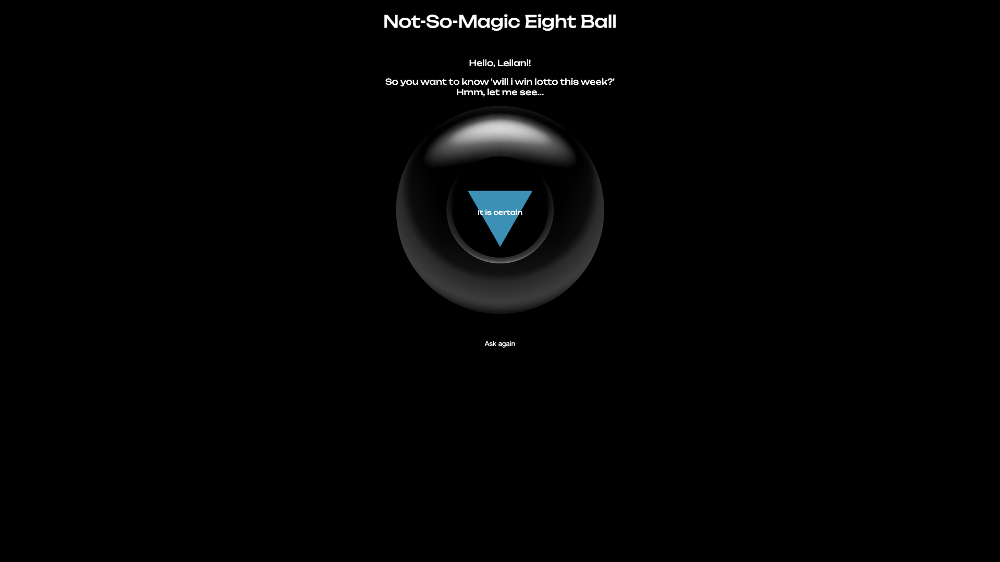

# Not So Magic Eight Ball 🎱
## A simple JS, HTML and CSS project to muck around with.

### Feel free to fork & clone it down, make it your own, fix bugs, write some tests, update the styling - whatever you'd like. It's all yours.

### Bug Report 🐞
- Not responsive CSS design
- `Ask Again` button reloads the page and a user has to re-enter their details.
- No tests!

There are probably heaps more, find them and make it your own!

### How to use
1. Fork a copy
2. Clone it down
3. Open `index.html` in a web browser or using the `Live Server` extension in VS Code if you have it

### TypeScript Branch
There is a wee `TS` branch with the same project converted.

If you're interested in running it and having a snoop around, you may need to run the following in your console
`npm i -D @types/node`

To quote the legend Gerard Paapu...

> This installs node and a package to help us out with types. Many JavaScript packages don't have their own type declarations, but there is a community project to provide 3rd party types 'Definitely Typed'. These 3rd party types aren't always perfect or up to date, but they can be really useful.This package provides types for node's builtin modules.

All `TypeScript` code is written here in `./src/magic-eight.ts`. Don't make edits to the `JavaScript` code. Make edits to the `TS` file, then run `npx tsc` to compile the programme. You'll see your edits converted from `TS` to `JS` in the `./dist` file.

### Rules
- `Main` & `TS` in this repo are protected, you cannot push to them.
- Please don't make `PR's` to this version. Make sure you fork and clone down your own version.
- Have fun ㋡
